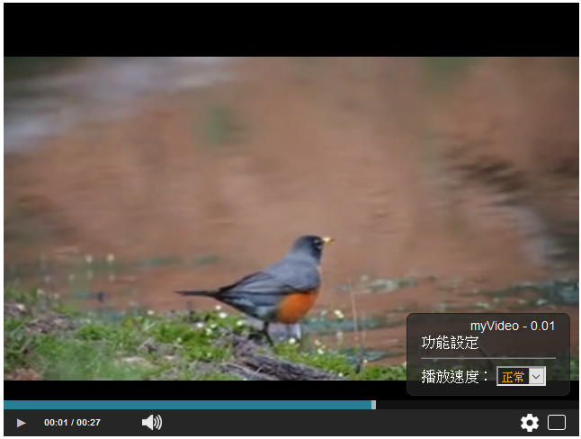

myVideo
=====

我的 Html5 Video 播放機，基於jQuery Plugin方式撰寫。

  <h2>我的 Html5 Video 播放機</h2>
   
  <h3>myVideo 哥的播放機</h3>
   
  <h4>自製 HTML5 播放機 UI，可以調整播放速度、合併多個不同來源的 MP4 檔案合併時間軸接序播放，基於jQuery Plugin方式撰寫。</h4>
   
   
  

  
   
  哥的播放機    
  

   
  <h2 class="title">程式資訊：</h2>
  

    Author： 
    &nbsp;&nbsp;&nbsp;&nbsp;&nbsp;&nbsp;&nbsp;&nbsp;
    Feather Mountain(羽山) <a target="_blank" href="http://3wa.tw">http://3wa.tw</a>
     
    版本： 
    &nbsp;&nbsp;&nbsp;&nbsp;&nbsp;&nbsp;&nbsp;&nbsp;V 0.01 
    License： 
    &nbsp;&nbsp;&nbsp;&nbsp;&nbsp;&nbsp;&nbsp;&nbsp;MIT License 
    官網： 
    &nbsp;&nbsp;&nbsp;&nbsp;&nbsp;&nbsp;&nbsp;&nbsp;
    <a target="_blank" href="http://3wa.tw/demo/htm/myVideo/">http://3wa.tw/demo/htm/myVideo/</a>
     
    &nbsp;&nbsp;&nbsp;&nbsp;&nbsp;&nbsp;&nbsp;&nbsp;
    <a target="_blank" href="https://github.com/shadowjohn/myVideo">https://github.com/shadowjohn/myVideo</a>
     
    程式名稱： 
    &nbsp;&nbsp;&nbsp;&nbsp;&nbsp;&nbsp;&nbsp;&nbsp;
    mybox 哥的播放機         
    Donwload： 
    &nbsp;&nbsp;&nbsp;&nbsp;&nbsp;&nbsp;&nbsp;&nbsp;
    <a target="_blank" href="http://3wa.tw/inc/javascript/jquery/myVideo/myVideo-lastest.js">myVideo-lastest.js</a>
    &nbsp;&nbsp;
    <a target="_blank" href="http://3wa.tw/inc/javascript/jquery/myVideo/myVideo.css">myVideo.css</a>        
         
    Key Word： 
    &nbsp;&nbsp;&nbsp;&nbsp;&nbsp;&nbsp;&nbsp;&nbsp;
    Html5 Video Player Merge 
     
  

  <h2 class="title">功能參數說明：</h2>
  <table border="1" cellpadding="5" cellspacing="0" class="thetable">
    <tr>
      <th>參數或方法</th>
      <th>名稱</th>
      <th>測試</th>
    </tr>
    <tr>
      <th>傳統用法</th>
      <td>        
<pre title='source_code' alt='source_code' id='source_code' class='comments'>
&lt;head&gt;
  &lt;!--在 head 加入 --&gt;
  &lt;script src="https://3wa.tw/inc/javascript/jquery/myVideo/myVideo-lastest.js"&gt;&lt;/script&gt;
  &lt;link href="https://3wa.tw/inc/javascript/jquery/myVideo/myVideo.css" rel="stylesheet" type="text/css" /&gt;
  &lt;script&gt;
    $(document).ready(function(){
      $("#demo1").myVideo();
    });
  &lt;/script&gt; 
&lt;/head&gt;
&lt;body&gt;
  &lt;video id="demo1" 
      poster="https://3wa.tw/demo/htm/myVideo/demo1/20200911_1599757205758_1599753607320.png"&gt;
    &lt;source 
      src="https://3wa.tw/demo/htm/myVideo/demo1/20200911_1599757205758_1599753607320.mp4" 
      type="video/mp4"&gt;
  &lt;/video&gt;
&lt;/body&gt;          
</pre>
      </td>
      <td>
        <a target="_blank" href="demo1/index.html">執行</a>
      </td>
    </tr>
    <tr>
      <th>基本參數</th>
      <td>
<pre title='source_code' alt='source_code' id='source_code' class='comments'>
{
  'width': '320px', /*調整寬*/
  'height':'240px', /*調整高*/
  'merge': false    /*不合併*/
}        
</pre>
      </td>
      <td>
        <a target="_blank" href="demo2/index.html">執行</a>
      </td>
    </tr>
    <tr>
      <th>參數說明</th>
      <td>
<pre title='source_code' alt='source_code' id='source_code' class='comments'>
{
  'width': '320px', /*調整寬*/
  'height':'240px', /*調整高*/
  'merge': true     /* 合併 */
}

//合併影片時，建議可以在 source 加一個參數，如 req_duration="471.388997"，如此可以加速載入速度
//duration 建議事先用 ffprobe 查詢，語法：
ffprobe 20200911_1599793208459_1599789604914.mp4 -show_streams -select_streams v:0 -of json ooxx.mp4

&lt;video id="demo1" 
        poster="https://3wa.tw/demo/htm/myVideo/demo1/20200911_1599757205758_1599753607320.png"&gt;    
  &lt;source req_duration="16.684" 
        src="https://images.all-free-download.com/footage_preview/mp4/deer_animal_food_eating_bushes_474.mp4"
        type="video/mp4"&gt;          
  &lt;source req_duration="10.544" 
        src="https://images.all-free-download.com/footage_preview/mp4/bird_small_animal_feathers_river_679.mp4" 
        type="video/mp4"&gt;
&lt;/video&gt;       
</pre>
      </td>
      <td>
        <a target="_blank" href="demo3/index.html">執行</a>
      </td>
    </tr>                     
  </table>
  <h2 class="title">ChangeLog</h2>
  

    <pre style="margin-left:20px;">
* Fri Sep 11 2020 Feather Mountain &lt;http://3wa.tw&gt; 0.01
- First initial
    </pre>
  

